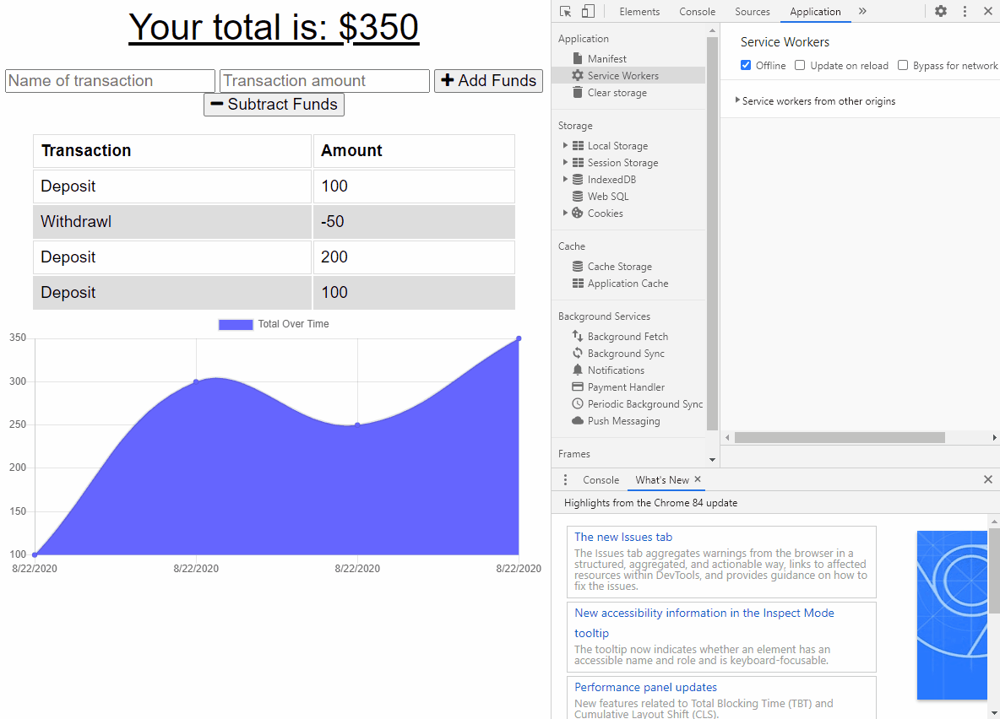
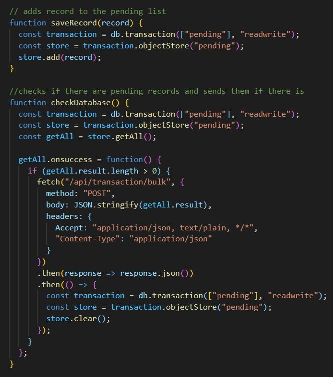

# hw-18-PWA
Online/Offline Budget Trackers

## Description

This homework was an intoduction to the IndexedDB, a tool for storing information on the user side for offline
capabilities. IndexedDB allows us to create a pending database of entries which automatically upload information
when the application is granted access to the internet again.

## Usage

The application is very simple to use. Simple add a transaction name and amount, then click the Add Funds or
Subtract Funds button to add the transaction. The graph and transaction list will then update, even if you aren't
connected to the internet. When the app connects the information added during the offline period is added to the
database seamlessly. Here is a short gif of the application running while offline, then turned back online to see
the data persist:

## Code

To get indexedDB to work, we needed to create a db.js file which told the database how to act when the application
isn't connected to the internet. The app itself also needed to submit transactions to the offline pending database
when it sensed it was unable to connect to the regular database. Here is some code showing the db.js file:

